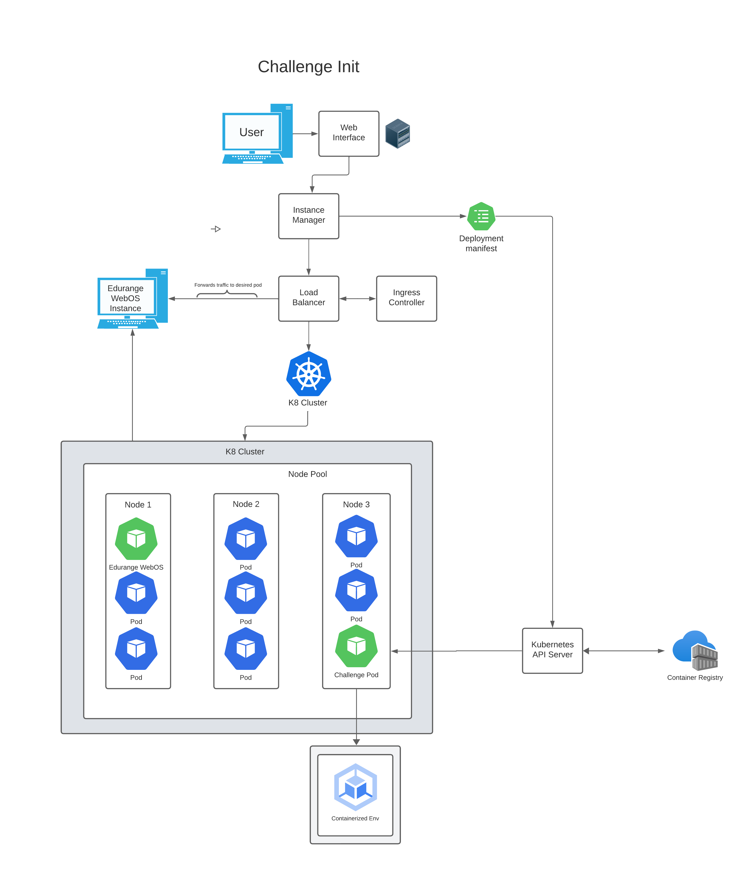

# EDURANGE CTF Module (WORK IN PROGRESS)


The EDURANGE CTF Module is a dynamic, Kubernetes-powered platform designed to host and manage Capture The Flag (CTF) challenges. It provides an automated system for deploying individual challenge instances, ensuring a unique and isolated environment for each participant.

### For detailed documentation visit [Documentation](https://edurange.atlassian.net/wiki/external/MzllMDZhYTFhMTMyNDE0Zjg0NmE0ZjI2Mzc0ZGQ3NWI)

## Features:

- **Dynamic Challenge Instances**: Utilizes Kubernetes to dynamically create and destroy challenge instances, allowing each user to have a unique experience.
- **Scalable and Isolated**: Leverages Kubernetes' scalability and isolation capabilities to manage multiple participants and challenges efficiently.
- **Diverse Challenge Support**: Offers support for various types of challenges, including web challenges and file carving, with many more to come in the future

## Why:

In the evolving landscape of cybersecurity education, traditional pedagogical approaches, predominantly characterized by lectures and textbook learning, are increasingly proving inadequate. The complexity and growing dynamism of cybersecurity threats necessitate a more hands-on, interactive learning experience that can prepare students for real-world challenges. Studies, such as the one conducted by Jones, Vagle, and Brunner (2020), highlight the critical need for educational methods that go beyond conventional teaching to include more engaging, practical exercises. These methods, as further detailed in a 2021 study by Smith and Doe, should not only encompass the theoretical aspects of cybersecurity but also provide immersive, scenario-based learning opportunities. The emergence of Capture The Flag (CTF) platforms, directly responds to this educational demand by gamifying the learning process, thereby enhancing student engagement and facilitating the application of knowledge in simulated cyberattack scenarios.

The necessity for innovation in the way we learn stems from the growing sophistication of cyber threats and the urgent need for skilled cybersecurity professionals capable of mitigating these risks. As noted in a 2018 study by Thompson and Lee, the gap between the skills taught in traditional educational settings and those required in the cybersecurity profession is widening. This discrepancy underscores the importance of integrating practical, hands-on experiences into cybersecurity education to bridge the skills gap effectively. The development and implementation of platforms like Edurange CTF embody this educational shift, offering a solution that not only captivates students' interest but also equips them with the critical thinking and problem-solving skills essential for success in the field of cybersecurity.


## Getting Started:

These instructions will probally get you a copy of the project up and running on your local machine for development and testing purposes. It also might not, the project is very early in development.


### Prerequisites:

- Docker
- Kubernetes cluster (Minikube for local development)
- Python 3.8+
- Flask

### Installation:

1. **Clone the Repository**

    ```bash
    git clone https://github.com/Rydersel/EDURANGE_CTF_Module.git
    cd EDURANGE_CTF_Module
    ```

2. **Set up a Kubernetes Cluster**

    For local development, start Minikube:

    ```bash
    minikube start
    ```

3. **Build and Deploy the Instance Manager**

    - Navigate to the Flask backend directory:

      ```bash
      cd instance-manager
      ```

    - Build the Docker image:

      ```bash
      docker build -t edurange-ctf-backend .
      ```

    - Apply Kubernetes configurations:

      ```bash
      kubectl apply -f k8s/
      ```

4. **Access the Web Interface**

    - Find the Minikube IP:

      ```bash
      minikube ip
      ```

    - Access the Flask application via the provided IP and NodePort specified in the service configuration.

### Usage:

To start a new CTF challenge instance:

1. Make a POST request to the Flask backend:

    ```bash
    curl -X POST http://<flask-backend-ip>:<port>/api/start-challenge -H "Content-Type: application/json" -d '{"user_id": "<user_id>"}'
    ```

2. Access the challenge instance through the provided URL.

## Diagram of Challenge Initialization(JUST FOR DEV, PROD INFA IS QUITE DIFFERENT, JUST HAVE NOT MADE A DIAGRAM YET CUZ IM LAZY): 


